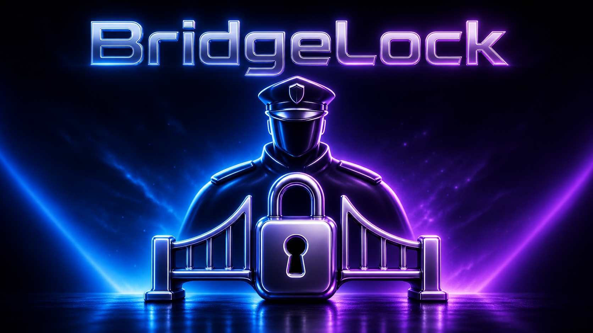

    

<h1 align="center">BridgeLock</h1>

    <strong>Secure a macOS virtual desktop with a PIN.</strong>

    BridgeLock adds an extra layer of privacy to Mission Control by protecting a selected virtual desktop with a secure PIN, allowing you to keep sensitive workspaces private without locking your entire Mac.

    
    
    
    

---

## Demo

    

BridgeLock protects a selected virtual desktop with a secure PIN while allowing the rest of your macOS environment to remain accessible. Designed as a lightweight native menu bar application, it integrates seamlessly with Mission Control and stores your PIN securely in the macOS Keychain.

---

## Features

- Protect a selected virtual desktop with a secure PIN
- Secure PIN storage using the macOS Keychain
- Native SwiftUI application
- Lightweight menu bar utility
- No cloud services
- No telemetry
- No internet connection required
- Local-first architecture
- Built exclusively for macOS

---

## Installation

Download the latest release from the **Releases** page.

1. Open the DMG.
2. Drag **BridgeLock.app** into the **Applications** folder.
3. Launch BridgeLock.
4. Grant Accessibility permission.
5. Configure your PIN.

---

## Requirements

- macOS 13 Ventura or later
- Apple Silicon or Intel

---

## Security

BridgeLock stores your PIN securely in the macOS Keychain.

- No analytics
- No tracking
- No cloud synchronization
- No external servers
- All data remains on your Mac.

---

## Built With

- Swift 6
- SwiftUI
- AppKit
- Security Framework
- ServiceManagement
- CoreGraphics

---

## Roadmap

- [ ] Support multiple protected desktops
- [ ] Touch ID authentication
- [ ] Keyboard shortcuts
- [ ] Auto-lock timers
- [ ] Custom lock screen themes
- [ ] Multi-monitor improvements
- [ ] Automatic activation upon opening an application

---

## Contributing

Contributions are welcome.

If you discover a bug or have an idea for an improvement, please open an Issue or submit a Pull Request.

Please discuss major changes before starting work.

---

## License

Copyright © 2025 Argyrios.

See the LICENSE file for licensing information.
